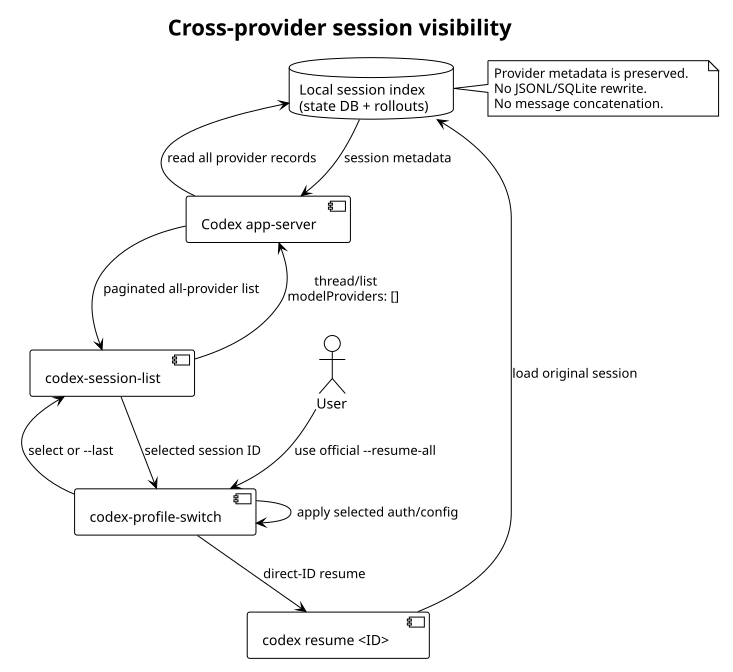

# 跨验证方式会话可见性

## 目标

切换 `official` 和 `api` 只切换当前认证与配置，不应让另一种验证方式创建的历史会话“消失”。这里的“合并会话”指让两种 provider 的历史会话出现在同一个可发现列表中，不是把两个会话的消息拼成一个新会话。

## 使用方式

```bash
# 只查看全部 provider 的本地会话
/root/.codex/bin/codex-profile-switch sessions

# 切换到官方验证后，从全部 provider 选择会话并继续
/root/.codex/bin/codex-profile-switch use official --resume-all

# 切换到官方验证后，直接继续全部 provider 中最新的会话
/root/.codex/bin/codex-profile-switch use official --resume-all --last

# 已知会话 ID 时跳过选择器
/root/.codex/bin/codex-profile-switch use official --resume-all <SESSION_ID>
```

`use api --resume-all` 的行为相同，只是最后运行会话时使用 API profile。

## 与原生 resume 的区别

`use <profile> --resume ...` 仍然原样调用 Codex 自带的 resume 流程；某些版本的原生 picker 会继续按当前 provider 过滤。`sessions` 和 `--resume-all` 是切换工具提供的显式全 provider 入口：先读取所有 provider 的会话 ID，再调用原生的 `codex resume <SESSION_ID>`。

因此，切换到官方验证模式后想查看第三方 API 会话，应使用：

```bash
/root/.codex/bin/codex-profile-switch use official --resume-all
```

如果已经知道 ID，也可以直接使用 `--resume-all <SESSION_ID>`；只想查看而不打开会话时使用 `sessions`。

## 数据流



`codex-session-list` 通过本地 Codex app-server 请求 `thread/list`，显式传入空的 `modelProviders` 数组和 `useStateDbOnly: true`。空数组表示不按当前 provider 过滤，`useStateDbOnly` 保证这里只读取已有会话索引，不扫描或改写 rollout 文件；结果分页读取后，选择器只把会话 ID 交回切换脚本，最后仍由原生 `codex resume <SESSION_ID>` 打开会话。

## 边界与安全性

- 列表默认只显示未归档的本地交互会话，并显示 provider、时间、ID 和截断标题。
- 脚本只读取 `state_*.sqlite`，不改写 SQLite、rollout JSONL 或会话中的 provider 元数据。
- 不复制、导入或拼接任何消息，因此不会生成一个伪造的“合并会话”。
- `--resume-all` 切换 profile 后才读取列表，随后用选中的会话 ID 调用 `codex resume`。
- 历史会话能被发现，不代表第三方 provider 的上下文一定能被官方 provider 继续执行；能否继续由 Codex 的会话兼容性和目标 provider 决定。
- 原有的 `use <profile> --resume ...` 仍然原样转发参数给原生 `codex resume`；需要跨 provider 发现时使用 `--resume-all`。
- 如果切换已完成但列表 helper 启动失败，当前 profile 可能已经生效；先运行 `status` 确认，再按[排障文档](../troubleshooting/cross-provider-session-visibility.md)处理或切回另一个 profile。

## 组件职责

| 组件 | 职责 |
| --- | --- |
| `codex-profile-switch` | 备份并切换 profile；协调选择和 resume |
| `codex-session-list` | 通过 app-server 分页读取全部 provider 的会话索引 |
| Codex app-server | 执行 `thread/list` 协议请求 |
| state DB / rollouts | 保存原始会话及其 provider 元数据 |
| `codex resume <SESSION_ID>` | 按 ID 打开选中的原始会话 |

## 相关排障

参见[跨 provider 会话可见性排障](../troubleshooting/cross-provider-session-visibility.md)。
